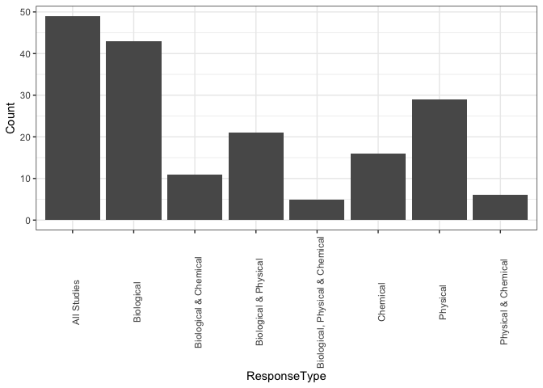

Extreme Events Exploratory Analysis
================
Erin Larson
11/13/2019

Importing data.

``` r
EEdata<-read.csv("EEData.csv")
```

``` r
EEdata_min<-EEdata[, 1:47]
```

Manipulating data to only include rows that have Biological response info.

``` r
EEdata_Bio<-subset(EEdata_min, BiologicalResponse_OrganismalGroup!="")
EEdata_Phys<-subset(EEdata_min, PhysicalResponseCategory!="")
EEdata_Chem<-subset(EEdata_min, ChemicalResponse_Category!="")
EEdata_BioPhys<-subset(EEdata_min, BiologicalResponse_OrganismalGroup!="" & PhysicalResponseCategory!="")
EEdata_BioChem<-subset(EEdata_min, BiologicalResponse_OrganismalGroup!="" & ChemicalResponse_Category!="")
EEdata_PhysChem<-subset(EEdata_min, PhysicalResponseCategory!="" & ChemicalResponse_Category!="")
EEdata_BioPhysChem<-subset(EEdata_min, BiologicalResponse_OrganismalGroup!="" & PhysicalResponseCategory!="" & ChemicalResponse_Category!="")
```

Counting number of studies that had biological, chemical, and physical responses.

``` r
EE_responsetype<-data.frame(ResponseType=c("All Studies", "Biological", "Physical", "Chemical", "Biological & Physical", "Biological & Chemical", "Physical & Chemical", "Biological, Physical & Chemical"))
EE_responsetype$Count[1]<-nrow(distinct(EEdata_min, UniqueAccession, .keep_all=TRUE))
EE_responsetype$Count[2]<-nrow(distinct(EEdata_Bio, UniqueAccession, .keep_all=TRUE))
EE_responsetype$Count[3]<-nrow(distinct(EEdata_Phys, UniqueAccession, .keep_all=TRUE))
EE_responsetype$Count[4]<-nrow(distinct(EEdata_Chem, UniqueAccession, .keep_all=TRUE))
EE_responsetype$Count[5]<-nrow(distinct(EEdata_BioPhys, UniqueAccession, .keep_all=TRUE))
EE_responsetype$Count[6]<-nrow(distinct(EEdata_BioChem, UniqueAccession, .keep_all=TRUE))
EE_responsetype$Count[7]<-nrow(distinct(EEdata_PhysChem, UniqueAccession, .keep_all=TRUE))
EE_responsetype$Count[8]<-nrow(distinct(EEdata_BioPhysChem, UniqueAccession, .keep_all=TRUE))
```

Making a plot of the number of studies that have looked at each type of response variable (biological, physical, chemical)

``` r
responseplot<-ggplot(EE_responsetype, aes(x=ResponseType, y=Count))+geom_bar(stat="identity")+theme_bw()+theme(axis.text.x=element_text(angle=90))

responseplot
```



``` r
EEdatasum <- EEdata_Bio %>%
    group_by(UniqueAccession, BiologicalResponse_OrganismalGroup) %>%
    summarize()

EEBioGroup <- EEdatasum %>%
    group_by(BiologicalResponse_OrganismalGroup) %>%
    summarize(count=n())

biogroupplot<-ggplot(EEBioGroup, aes(x=BiologicalResponse_OrganismalGroup, y=count))+geom_bar(stat="identity")+theme_bw()+theme(axis.text.x=element_text(angle=90))

biogroupplot
```


``` r
EEtrophicsum <- EEdata_Bio %>%
    group_by(UniqueAccession, BiologicalResponse_TrophicLevel) %>%
    summarize()
```

    ## Warning: Factor `BiologicalResponse_TrophicLevel` contains implicit NA,
    ## consider using `forcats::fct_explicit_na`

``` r
EETrophic <- EEtrophicsum %>%
    group_by(BiologicalResponse_TrophicLevel) %>%
    summarize(count=n())
```

    ## Warning: Factor `BiologicalResponse_TrophicLevel` contains implicit NA,
    ## consider using `forcats::fct_explicit_na`

``` r
trophicplot<-ggplot(EETrophic, aes(x=BiologicalResponse_TrophicLevel, y=count))+geom_bar(stat="identity")+theme_bw()+theme(axis.text.x=element_text(angle=90))

trophicplot
```


This creates an overwhelming plot...

``` r
EEBioResponse <- EEdata_Bio %>%
    group_by(UniqueAccession, BiologicalResponseMeasured, BiologicalResponse_Significance, ProximateEvent_Type) %>%
    summarize()

EEBioMeasure <- EEBioResponse %>%
    group_by(BiologicalResponseMeasured) %>%
    summarize(count=n())

bioresponseplot<-ggplot(EEBioMeasure, aes(x=BiologicalResponseMeasured, y=count))+geom_bar(stat="identity")+theme_bw()+theme(axis.text.x=element_text(angle=90))

bioresponseplot
```


``` r
EEBioResponse$BroadMeasureType <- factor(rep(NA,length(EEBioResponse$BiologicalResponseMeasured)),
                                   levels=c("biomass", "abundance/density", "movement", "community structure", "community function", "reproduction", "individual condition", "evolutionary response"))

EEBioResponse$BroadMeasureType[EEBioResponse$BiologicalResponseMeasured %in% c("annual biomass","aboveground biomass","belowground biomass","biomass","summer biomass", "EVI")] <- "biomass"

EEBioResponse$BroadMeasureType[EEBioResponse$BiologicalResponseMeasured %in% c("abundance","annual abundance", "catches or landings", "density", "percent occurrence", "occupancy rate", "percent cover", "summer abundance", "annual Year of Young", "summer Year of Young", "population size structure")] <- "abundance/density"

EEBioResponse$BroadMeasureType[EEBioResponse$BiologicalResponseMeasured %in% c("behavior - movement", "colonization rate")] <- "movement"

EEBioResponse$BroadMeasureType[EEBioResponse$BiologicalResponseMeasured %in% c("annual evenness", "annual richness", "diversity", "functional beta diversity", "functional community structure","phenotypic diversity", "species evenness", "species richness", "summer evenness", "summer richness", "taxonomic beta diversity", "taxonomic diversity", "taxonomic richness", "macroinvertebrate community index", "community composition", "foodweb structure",  "taxonomic community structure")] <- "community structure"

EEBioResponse$BroadMeasureType[EEBioResponse$BiologicalResponseMeasured %in% c("carbon assimilation", "stability and persistence")] <- "community function"

EEBioResponse$BroadMeasureType[EEBioResponse$BiologicalResponseMeasured %in% c( "male survival", "reproduction - nest quantity", "reproduction - ovulation rate", "reproduction - young survival" )] <- "reproduction"

EEBioResponse$BroadMeasureType[EEBioResponse$BiologicalResponseMeasured %in% c("body condition", "diet", "growth",  "infection rate", "leaf carbon isotope ratio", "metabolism", "mortality", "ratio of leaf chlorophyl a:b", "rhizome starch levels", "rhizome sugar level", "seawater readiness", "stomach fullness", "stress - cortisol level", "total leaf chlorophyl"   )] <- "individual condition"

EEBioResponse$BroadMeasureType[EEBioResponse$BiologicalResponseMeasured %in% c("extinction rate")] <- "evolutionary response"

##getting unique studies so not double-counting the broad measure type
EEBioMeasureUnique<-distinct_at(EEBioResponse, vars(UniqueAccession, BroadMeasureType))

broadbiomeasureplot<-ggplot(EEBioMeasureUnique, aes(x=BroadMeasureType))+geom_bar()+theme_bw()+theme(axis.text.x=element_text(angle=90))
broadbiomeasureplot
```


``` r
EEBioResponse$OrgLevel <- factor(rep(NA,length(EEBioResponse$BiologicalResponseMeasured)),
                                   levels=c("population", "community", "ecosystem"))

EEBioResponse$OrgLevel[EEBioResponse$BiologicalResponseMeasured %in% c("annual biomass","aboveground biomass","belowground biomass","biomass","summer biomass", "EVI")] <- "ecosystem"

EEBioResponse$OrgLevel[EEBioResponse$BiologicalResponseMeasured %in% c("abundance","annual abundance", "catches or landings", "density", "percent occurrence", "occupancy rate", "percent cover", "summer abundance", "annual Year of Young", "summer Year of Young", "population size structure",  "male survival", "reproduction - nest quantity", "reproduction - ovulation rate", "reproduction - young survival", "body condition", "diet", "growth",  "infection rate", "leaf carbon isotope ratio", "metabolism", "mortality", "ratio of leaf chlorophyl a:b", "rhizome starch levels", "rhizome sugar level", "seawater readiness", "stomach fullness", "stress - cortisol level", "total leaf chlorophyl", "behavior - movement", "carbon assimilation")] <- "population"


EEBioResponse$OrgLevel[EEBioResponse$BiologicalResponseMeasured %in% c("annual evenness", "annual richness", "diversity", "functional beta diversity", "functional community structure","phenotypic diversity", "species evenness", "species richness", "summer evenness", "summer richness", "taxonomic beta diversity", "taxonomic diversity", "taxonomic richness", "macroinvertebrate community index", "community composition", "foodweb structure",  "taxonomic community structure", "stability and persistence", "colonization rate", "extinction rate")] <- "community"

##getting unique studies so not double-counting the broad measure type
EEOrgLevelUnique<-distinct_at(EEBioResponse, vars(UniqueAccession, OrgLevel, BiologicalResponse_Significance, ProximateEvent_Type))

orglevelplot<-ggplot(EEOrgLevelUnique, aes(x=OrgLevel, fill=BiologicalResponse_Significance))+geom_bar()+theme_bw()+theme(axis.text.x=element_text(angle=90))+xlab("Level of Biological Organization")+ylab("Number of Studies")
orglevelplot+facet_wrap(~ProximateEvent_Type)
```


